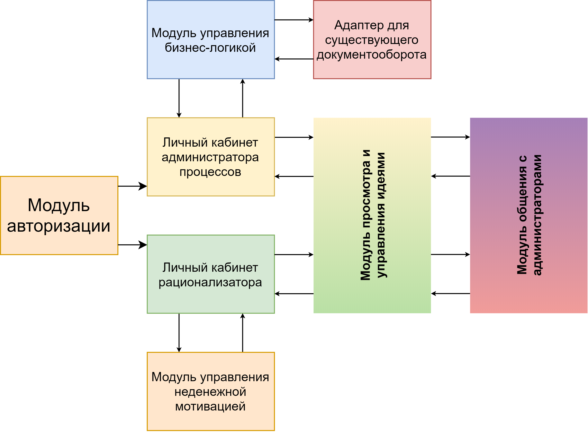

# Архитектура платформы
Архитектура платформы модульная - это позволяет разбить платформу на логические части, распараллелить работу над частями системы и проще формализовать документацию.

Структурная схема решения предоствлена ниже:

## Подробное описание модулей
- **Модуль авторизации**

    Позволяет управлять правами доступа, авторизуя и рационализаторов, и администраторов

- **Личный кабинет адмиинистратора процессов**

    Администратор процессов - любой человек, ответственный за анализ и сопровождение заявок.
    Позволяет просматривать заявки, которые были назначены администратору и  общаться с их создателями

- **Личный кабинет рационализатора**

    Позволяет создавать заявки, редактировать их, отслеживать их статус

- **Модуль просмотра и управления идеями**

    Большой модуль, отвечающий за правильное форматирование и отображения содержимого идеи, ее статуса, а также формирование версии для предпросмотра для использования в списках.

    Помимо этого, отвечает за общение между пользователями платформы

- **Модуль общения с администраторами** 

    Позволяет наглядно отслеживать прогресс заявки, общаться с администраторами и обмениваться с ними файлами и документами.

- **Модуль бизнес-логики**

    Основной компонент, который отвечает за сериализацию и хранение данных, управление этапами сопровождения заявок, автоматизацию процессов

- **Адаптер для существующего документооборота**

    Для обеспеения плавности внедрения платформы необходимо обеспечить возможность интеграции наших алгоритмов в существующие процессы. Для этого используется специальный интерфейс, который преобразует данные платформы в "старые" документы и наоборот