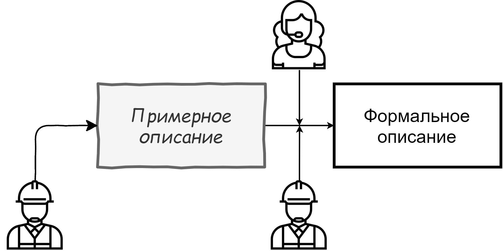

# О процессах
Платформа диктует новые процессы и принципы взаимодействия **рационализаторов** - работников компании, которые хотят поделиться своими идеями - и **администраторов** - сотрудников, которые ответственны за обработку и сопровождение идей

Текущая реализация процессов не подразумевает активного диалога между рационализатором и администратором. Отсутствие возможности исправления *"на лету"* недочетов, которые могут помешать принятию предложения - один из сильнейших демотиваторов, которые препятствуют активной рационализаторской деятельности.

Вместо этого мы предлагаем внедрить модель, основанную на *постоянном взаимодействии* администратора и рационализатора - **плавную формализацию**. Она не только позволит легко исправлять и дополнять предложение по мере необходимости, но и **постепенно заполнять** его - сначала автор высказывает общую суть проблемы и идею решения, а затем, с активной помощью администратора, оформляет его в виде строгого документа.

Такой подход позволит не только серьезно уменьшить вероятность появления ошибок и неточностей в заявках, но и упростить процесс формирования заявки - рационализатору придется гораздо меньше беспокоиться насчет формальностей.

Помимо этого, такой процесс позволит рационализаторам делиться опытом на платформе не только в виде документов, но в формате **удобночитаемых статей** - это упростит неформальный процесс обмена опытом между работниками компании.
## Процесс перехода на новые процессы
Резкий переход на новые процессы очень болезнен для любой компании. Поэтому мы предлагаем релизовать систему с учетом уже текущей бюрократической структуры с помощью специального модуля реализовать **интерфейс** между старыми процессами - формальными документами - и новыми - на нашей платформе.

Этот модуль позволит полу- или полностью автоматически переводить электронные документы, использующиеся на данный момент, в данные в системе, и наоборот. Это позволит безболезненно внедрить нашу платформу